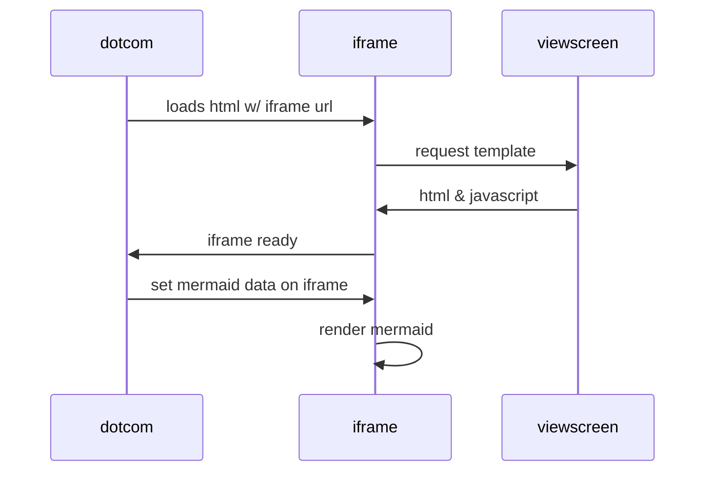

# Learn Private Module Registry

The companion repository for the [Learn guide](https://learn.hashicorp.com/terraform/modules/private-modules) on using the private module registry in Terraform Cloud.

